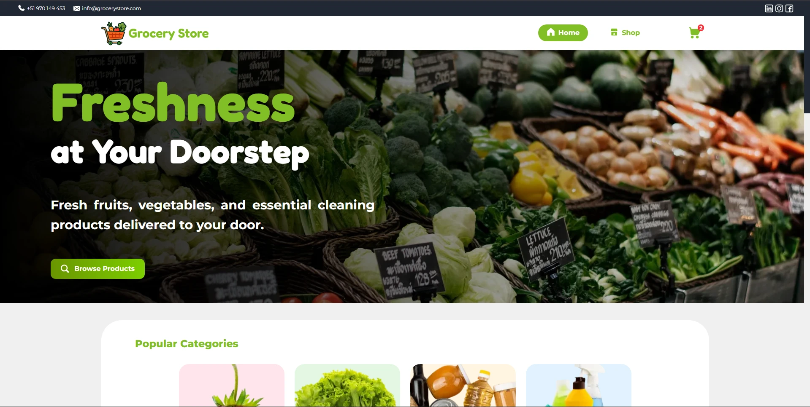

# 🛒 Grocery Store

Official website for Grocery Store, an online shop offering fresh groceries, fruits, vegetables, cleaning products, and more.
The project aims to provide customers with an intuitive and fast shopping experience, featuring a clean design and responsive interface.

🌐 **Live site:** [https://grocery-store.jexugaz.work/home](https://grocery-store.jexugaz.work/home)

## 🎯 Purpose of the Website

This website was created as a modern and user-friendly platform to showcase and sell grocery products online.
It is designed for convenience, allowing customers to explore products, check discounts, and enjoy a smooth shopping experience across all devices.

---

## 📸 Preview



---

## 🧾 Features

- ✨ Clean and responsive design
- 🛍️ Product listing with prices, discounts, and categories
- 📦 Cart-ready product cards
- 📱 Mobile-friendly layout
- 🎨 Smooth animations powered by Framer Motion
- 🖼️ Optimized images using Next.js Image
- 🚀 Deployed on Vercel with GitHub integration
- 🔌 API integration with a C# backend (in feature-api branch) for real data — current deployed version uses hardcoded sample data

---

## 📁 Project Structure

```
src/
├── app/         # Next.js app directory and routes
├── components/  # Reusable UI components
├── data/        # Static and mock data
├── hooks/       # Custom React hooks
├── services/    # API service functions
├── types/       # TypeScript type definitions
└── utils/       # Helper functions and constants
```

---

## ⚙️ Local Setup and Development

1. **Clone the repository:**

```bash
git clone https://github.com/JexUgaz/grocery-store-frontend.git
cd grocery-store-frontend
```

2. **Install dependencies:**

```bash
npm install
```

3. **Start the development server:**

```bash
npm run dev
```

## 📦 Build for Production

```bash
npm run build
```

The production-ready files will be generated in the `.next` folder.

## 🧪 Tech Stack

- [Next.js](https://nextjs.org/)
- [React](https://reactjs.org/) (for interactive components)
- [TypeScript](https://www.typescriptlang.org/)
- [Tailwind CSS](https://tailwindcss.com/)
- [Vercel](https://vercel.com/) for deployment
- C# API (in `feature-api` branch) for backend data connection
